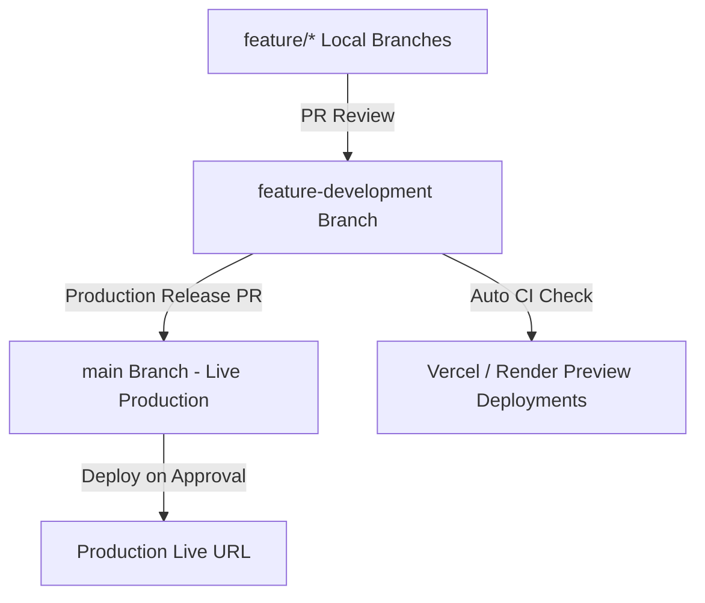

# JalRakshak AI — Safe Development & Release Workflow Guide

This document establishes the safe software development life cycle (SDLC) for **JalRakshak AI** to ensure that active feature development, bug fixing, and UI enhancements **never break the public live production application**.

---

## 1. Branch Strategy & Environments



| Branch Name | Purpose | Target Environment | Auto-Deploy Policy |
| :--- | :--- | :--- | :--- |
| `main` | Production-ready, stable showcase release | Production Live Site | Deploys ONLY on approved release PR merge |
| `feature-development` | Staging branch for active feature development & testing | Preview / Staging URL | Automatic preview build on push |
| `feature/*` | Individual feature or bug-fix working branches | Local Sandbox / PR Preview | Non-production |

---

## 2. Production Protection Rules

1. **`main` Branch Shielding:**
   - Never commit directly to `main`.
   - Never force push (`git push --force`) to `main` or `origin/main`.
   - `main` strictly represents the latest verified production build.

2. **Isolated Database Policy:**
   - Local development uses isolated SQLite databases (`jalrakshak.db` / in-memory DBs).
   - Preview deployments must use staging databases or isolated schemas.
   - **NEVER** run developmental database resets, drop tables, or destructive migrations against the live production database.

3. **Secrets & Environment Isolation:**
   - Production API keys, JWT secrets, database connection strings, and satellite credentials reside strictly in cloud environment variables (e.g. Vercel / Render Dashboard).
   - Development variables are stored in local `.env` files (ignored by Git via `.gitignore`).
   - `.env.example` templates contain non-sensitive sample keys.

---

## 3. Deployment Configuration Best Practices

### Frontend Deployment (e.g., Vercel / Netlify)
- **Production Branch:** Set to `main`.
- **Preview Deployments:** Enable automatic Preview Deployments for `feature-development` and all Pull Requests.
- **Environment Variables:**
  - Production: `VITE_API_BASE_URL=https://<your-backend-production-domain>.com`
  - Preview/Staging: `VITE_API_BASE_URL=https://<your-backend-staging-domain>.com`

### Backend Deployment (e.g., Render / Fly.io / AWS)
- **Production Service:** Connected to branch `main`.
- **Start Command:** `python -m uvicorn app.main:app --host 0.0.0.0 --port $PORT`
- **Health Check Path:** `/api/v1/health`
- **Database Connection:** Production PostgreSQL / SQLite persistence path configured via `DATABASE_URL`.

---

## 4. Production Release Safety Checklist

Before merging `feature-development` into `main` for a live production update, complete and verify every item in this checklist:

- [ ] **Automated CI Check Passes:** GitHub Actions workflow `ci-cd.yml` passes for both backend tests (`pytest`) and frontend build (`npm run build`).
- [ ] **Local Integration Verification:** Backend pytest suite (`10/10 passed`) and Vitest suite (`16/16 passed`) run cleanly without errors.
- [ ] **Frontend Build Clean:** `npm run build` generates optimized chunks without TypeScript or bundle compilation errors.
- [ ] **Map Explorer Verification:** Base map tiles render cleanly, layers toggle correctly, and map provider keys are valid.
- [ ] **API Contract Compatibility:** OpenAPI specs and response schemas on `/docs` match frontend client interfaces without breaking existing callers.
- [ ] **Field Evidence & Photo Upload:** Photo upload, EXIF extraction, and site linking work seamlessly.
- [ ] **Verification Workflow:** Field task status transitions (`pending` → `verified`/`rejected`) function accurately and persist across server restarts.
- [ ] **Database Migration Plan:** Schema updates are non-destructive and backward-compatible.
- [ ] **Environment Variable Verification:** All required production keys are populated in hosting dashboards before code deployment.
- [ ] **Manual Approval:** The project lead has tested the Preview URL and given explicit approval to merge into `main`.

---

## 5. Development Commands Reference

```powershell
# 1. Switch to development branch
git checkout feature-development

# 2. Run backend tests
cd backend
python -m pytest tests

# 3. Run frontend tests and build
cd ..
npm test -- --run
npm run build

# 4. Push feature development updates to remote
git push origin feature-development
```
