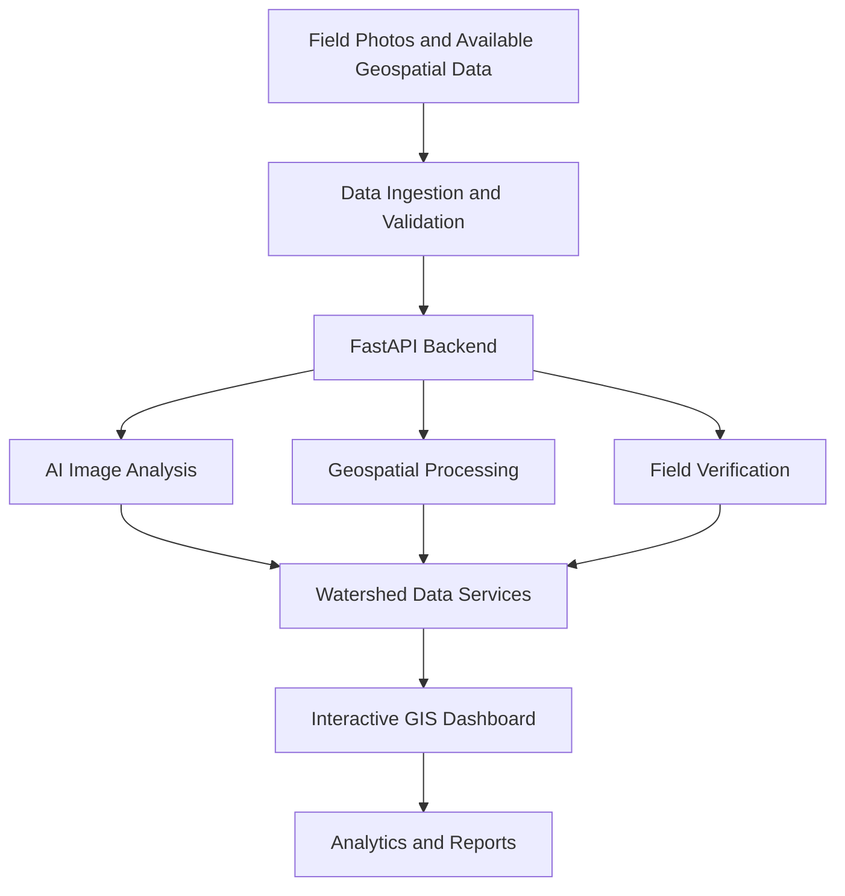

# JalRakshak-AI
# 🌊 JalRakshak AI — Intelligent Watershed Monitoring & Management

## 📌 Overview

**JalRakshak AI** is a proposed intelligent watershed monitoring and management platform designed to help stakeholders understand watershed conditions, monitor water-related interventions, and track environmental changes using geospatial data, field evidence, and AI-assisted analysis.

Traditional watershed monitoring often depends on manual surveys, scattered photographs, and periodic reporting. These methods can make it difficult to track interventions consistently, compare conditions over time, and make evidence-based decisions.

JalRakshak AI aims to bring these activities together in a unified web-based GIS platform.

## 🎯 Focus & Mission

**Watershed Monitoring & Evidence-Led Verification**

Watershed development requires reliable information about land use, drainage networks, vegetation cover, soil conditions, water bodies, and the progress of interventions. Conventional monitoring processes can be time-consuming, difficult to scale, and challenging to verify across large geographical areas.

The challenge is to build a digital solution that supports spatial monitoring, evidence-based assessment, and accessible reporting for watershed development activities.

## 💡 Our Solution

JalRakshak AI combines mapping, field evidence, geospatial analysis, and AI-assisted workflows in one platform.

### Core Features

- **Interactive Map Explorer:** Explore watershed regions, mapped water bodies, intervention sites, and available field observations.
- **Geo-tagged Field Evidence:** Upload field photographs and associate them with locations and relevant project metadata.
- **AI-assisted Image Analysis:** Integrate object detection, including YOLO-based inference where configured, to assist with image assessment.
- **Satellite and Geospatial Analysis:** Support suitable imagery and derived layers such as NDVI, NDWI, land-use/land-cover, elevation, and slope when the required datasets are available.
- **Before-and-After Comparison:** Compare available observations or imagery across different dates to investigate environmental changes.
- **Field Verification Workflow:** Organize observations and verification tasks for review by authorized users.
- **Watershed Analytics Dashboard:** Present available statistics, intervention summaries, and spatial indicators.
- **Automated Reporting:** Generate structured reports from available project data.
- **Search and Notifications:** Help users find mapped features and stay informed about relevant tasks or updates.
- **Guided User Experience:** Provide a walkthrough to help new users navigate the platform.

> **Data integrity:** AI detections, satellite-derived indicators, field observations, and verified outcomes are different types of evidence. The platform should label their sources and verification status clearly. Demo data must not be presented as live or field-verified data.

## 🏗️ System Architecture



The architecture is intended to separate the frontend, API services, AI inference, geospatial processing, and reporting components so they can be developed and maintained independently.

## 🛠️ Technology Stack

The final stack should reflect the libraries and services actually used in the repository.

| Component | Technology |
|---|---|
| Frontend | React / Vite or Next.js, depending on the existing application |
| Backend API | Python, FastAPI |
| AI inference | YOLO-based object detection, when configured |
| Interactive mapping | Mapbox GL or Leaflet, depending on implementation |
| Geospatial analysis | Suitable GIS and raster-processing libraries |
| Data storage | Configured database and file/object storage |
| API documentation | FastAPI Swagger UI / OpenAPI |
| Version control | Git and GitHub |
| Deployment | A suitable frontend host and backend host |

## 🔄 How It Works

1. **Collect data:** Import available watershed information, field photographs, and supported geospatial datasets.
2. **Validate evidence:** Check file formats, timestamps, coordinates, and required metadata.
3. **Process observations:** Run configured image-analysis and geospatial-processing workflows.
4. **Explore the map:** View available features and spatial layers through the Map Explorer.
5. **Review findings:** Compare observations and inspect the source and quality of supporting evidence.
6. **Verify in the field:** Allow authorized users to review evidence and record verification decisions.
7. **Generate reports:** Produce summaries using available observations, analysis outputs, and verification records.

## 🚀 Getting Started

### Prerequisites

Install the following tools as needed by your repository:

- Git
- Node.js and npm
- Python 3.10 or a version compatible with the backend dependencies
- A supported database, if required
- Map service credentials, if required by the chosen map provider

### 1. Clone the repository

Replace the placeholder with your actual GitHub repository URL.

```bash
git clone <YOUR_GITHUB_REPOSITORY_URL>
cd <YOUR_PROJECT_DIRECTORY>
```

### 2. Set up the frontend

Navigate to the frontend directory. If the frontend is at the repository root, run these commands there instead.

```bash
cd frontend
npm install
```

Create a `.env` file in the frontend root.

For a Vite application:

```env
VITE_API_BASE_URL=http://127.0.0.1:8000
```

For a Next.js application, use the appropriate variable instead:

```env
NEXT_PUBLIC_API_BASE_URL=http://127.0.0.1:8000
```

Only configure the variable that matches your frontend framework. Add other required public configuration, such as a map token, according to your implementation.

Start the development server:

```bash
npm run dev
```

### 3. Set up the FastAPI backend

Open a second terminal and navigate to the backend directory.

```bash
cd backend
```

Create and activate a virtual environment on Windows:

```powershell
python -m venv .venv
.\.venv\Scripts\Activate.ps1
```

Install the dependencies:

```powershell
python -m pip install -r requirements.txt
```

If the repository does not contain `requirements.txt`, install the actual dependencies defined by your project rather than assuming this command is sufficient.

Start the API, assuming the entry point is `app/main.py`:

```powershell
python -m uvicorn app.main:app --reload --host 127.0.0.1 --port 8000
```

If your backend uses a different entry point or directory structure, adjust the command accordingly.

### 4. Verify the API

With the backend running, open:

- **Swagger UI:** `http://127.0.0.1:8000/docs`
- **OpenAPI schema:** `http://127.0.0.1:8000/openapi.json`

These addresses are for local development. A deployed application must use the configured production API URL.

## 🔐 Environment Variables and Security

- Keep private API keys, database credentials, and secrets in environment variables.
- Never commit `.env` files containing secrets.
- Provide a `.env.example` containing variable names and safe placeholder values.
- Configure backend CORS to allow only the intended frontend origins.
- Validate uploaded files and enforce appropriate file-size and type limits.
- Apply authentication and authorization to protected operations where required.

## 📊 Data and Evidence Principles

JalRakshak AI should distinguish between:

- **Observed data:** Information collected from field surveys, photographs, sensors, or documented sources.
- **Derived data:** Indicators calculated from imagery or other input datasets.
- **AI-generated outputs:** Model predictions that require appropriate interpretation and validation.
- **Verified evidence:** Findings reviewed according to a documented verification process.
- **Demonstration data:** Synthetic or sample information used to demonstrate the application.

An evidence-quality score, if implemented, should describe the completeness and reliability of the supporting evidence—not automatically claim that a watershed intervention has succeeded.

Satellite resolution, image dates, cloud cover, geolocation accuracy, and data availability should be considered when interpreting results. Small structures may not be detectable in moderate-resolution satellite imagery.

## 🌱 Expected Impact

The proposed platform aims to:

- Reduce fragmentation in watershed monitoring workflows.
- Improve the organization and traceability of field evidence.
- Make spatial information easier to explore and communicate.
- Support the comparison of observations over time.
- Assist reviewers in identifying records requiring field verification.
- Improve the accessibility of watershed monitoring reports.
- Support more informed planning and monitoring decisions.

These are intended benefits; actual impact must be evaluated using real data and appropriate validation.

## 🧪 Testing and Validation

Before deployment, validate the following:

- API connectivity and error handling.
- Image uploads and metadata extraction.
- AI inference outputs against reviewed samples.
- Map coordinates and geospatial layer alignment.
- Field verification workflows and access controls.
- Report generation and data consistency.
- Responsive behavior across desktop and mobile devices.
- Performance with representative datasets.

Document measured results only after running the corresponding tests.

## 🗺️ Roadmap

- [ ] Complete the interactive Map Explorer.
- [ ] Connect frontend features to the actual FastAPI endpoints.
- [ ] Implement reliable geo-tagged photo uploads.
- [ ] Integrate and evaluate AI image inference.
- [ ] Add supported satellite and geospatial analysis layers.
- [ ] Implement field verification and review workflows.
- [ ] Generate downloadable monitoring reports.
- [ ] Add automated tests and error handling.
- [ ] Deploy the frontend and backend.
- [ ] Evaluate the platform with representative watershed data.

## 🤝 Contributing

Contributions, feedback, and suggestions are welcome.

1. Fork the repository.
2. Create a feature branch.
3. Make your changes and add appropriate tests.
4. Open a pull request describing the changes.

Please avoid committing credentials, private datasets, or unverified claims about field outcomes.

## 👥 Team

**Project:** JalRakshak AI  
**Domain:** Watershed Intelligence & GIS Monitoring  
**Institution:** CGC University

Add your team name, team members, mentor, and official problem-statement details here as appropriate.

## 📄 License

Choose and add a license that matches your team's ownership and distribution requirements. Until a license is added, do not assume that others have permission to reuse the project's code.

---

<p align="center">
  <strong>JalRakshak AI — Better evidence. Smarter watershed monitoring. More informed decisions.</strong>
</p>
